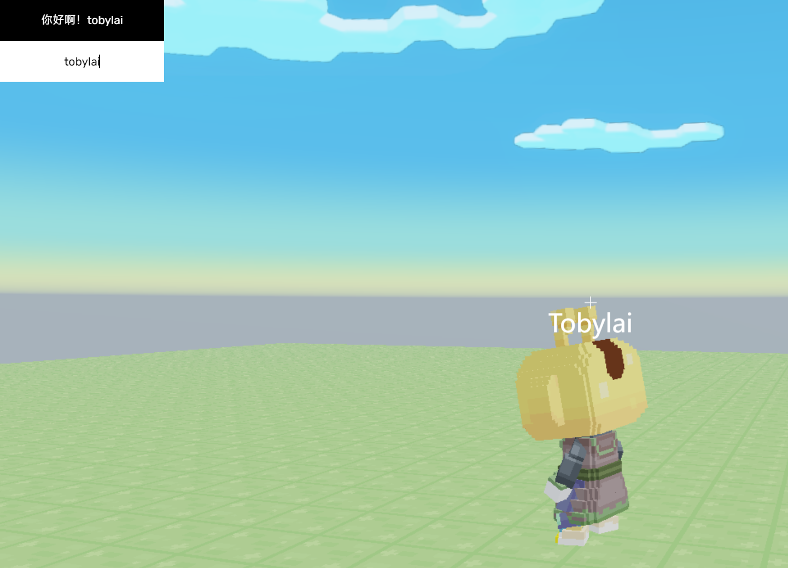

import Tabs from '@theme/Tabs';
import TabItem from '@theme/TabItem';

# 快速上手
:::warning
本文默认你已经掌握 **ArenaPro(或者ArenaLess)** 插件的基本用法，如未了解，请先阅读[ArenaPro](https://www.yuque.com/box3lab/arenapro)插件文档。
:::
本篇文章将让您快速入门Areact，从项目创建、配置到开发、部署。

## 环境要求
1. VSCode（版本尽可能在1.93左右）
    :::tip
    如果无法使用桌面端VSCode配合AP/AL进行开发，那么可以试一试[vscode.dev](https://vscode.dev)+[ArenaLess](/docs/arenaless/)的组合
    :::
2. VSCode扩展 [ArenaPro(AP)](https://www.yuque.com/box3lab/arenapro)或者[ArenaLess(AL)](/docs/arenaless/)

## 创建项目并完成JSX配置
### 1. 创建项目
在VSCode中按下<kbd>Ctrl+Shift+P</kbd>，输入命令并找到创建项目的命令，运行它。
:::note
- 在 ArenaPro 中，这个命令叫`ArenaPro: 新建Arena-Ts项目`
- 在 ArenaLess 中，这个命令叫`ArenaLess: 创建ArenaLess项目`

这两个扩展创建的项目结构几乎是相同的
:::
### 2. 修改文件名和入口点
- 把 `client/src/clientApp.ts` 重命名为-> `client/src/clientApp.tsx`
- 将 `dao3.config.json` 中的 `client->entry` 改为 `src/clientApp.tsx`（类似下面这样）
    ```js title="dao3.config.json"
    {
        "client": {
            "base": "./client",
            // 修改这里
            "entry": "src/clientApp.tsx",
            //...省略...
        }
    }
    ```
### 3. 修改client/tsconfig.json
需要在`compilerOptions`中加入一些`jsx/tsx+areact`相关的配置
```js title="client/tsconfig.json"
    {
        "compilerOptions": {
            // ...省略...
            // 这四行是要添加的内容
            "noImplicitAny": false,
            "jsx": "react",
            "jsxFactory": "Areact.h",
            "jsxFragmentFactory": "Areact.frag"
            // ...省略...
        }
    }
```
:::info
请记住，如果你下次还要创建一个这样的项目的话依旧要完成以上步骤
:::
## 安装 Areact
对于ArenaPro和ArenaLess有不同的安装步骤。
<Tabs>
    <TabItem value="ap" label="ArenaPro Creator" default>
```sh title="在项目根目录打开VSCode的终端，输入以下命令："
npm install --save dao3-areact
```
    </TabItem>
    <TabItem value="al" label="ArenaLess">
```js title='在importMap.arenaless.jsonc的"imports"中添加：'
{
    "imports":{
        // 在这里加入一条导入
        "dao3-areact":"npm:dao3-areact"
    }
}
```
    </TabItem>
</Tabs>

## 你的第一段代码
好了，所有的配置工作完工了，现在开始写你的第一段代码吧！
<details>
  <summary>点击查看完整代码</summary>
```tsx title="client/src/clientApp.tsx"
import { Areact, hooks } from "dao3-areact";
import { Text } from "dao3-areact/components";
let app = new Areact();
function App() {
  const [count,setCount]=hooks.useState(0);
  return (<>
    <Text x="0px" y="0px" height="50px" width="200px"
      backgroundColor="#000000"
      textColor="#ffffff"
      backgroundOpacity="100%"
      text={`你点我点了${count}下`}
      onClick={(e)=>{setCount(count+1)}}
    ></Text>
  </>);
}
app.mount(<App />, ui);
```
</details>

> 接下来是分解教程
### 1. 导入
```tsx
import { Areact, hooks } from "dao3-areact";
import { Text } from "dao3-areact/components";
```
- `Areact`是框架
- `hooks`是`react(preact)`的`hooks`，详见[Built-in React Hooks（React文档）](https://react.dev/reference/react/hooks)
- `Text`是一个文本组件，就类似原岛三ui中的UiText，以下是所有的组件：
    - `Text` 显示文本的组件
    - `Image` 显示图片的组件
    - `Input` 显示输入框的组件
    - `Box` 一个框架组件，没有什么特征
### 2. 创建 入口点组件
```tsx
let app = new Areact();
function App() {
  // 待会添加的内容
  return (<>
    {/* ... 这里是待会要填充的组件 ...*/}
  </>);
}
// 将入口点组件挂载到Areact上运行渲染
app.mount(<App/>,ui)
```
最基础的部分已经ok了，但是你现在运行见不到任何效果，那是因为你还没有添加其他组件。
### 3. 文本组件
接下来，我们修改`function App(){}`的内容，添加一个文本组件：
```tsx
function App() {
  // 待会添加的内容
  return (<>
    <Text x="0px" y="0px" height="50px" width="200px"
      backgroundColor="#000000"
      textColor="#ffffff"
      backgroundOpacity="100%"
      text={`我是一个文本框`}
    ></Text>
  </>);
}
```
<details>
    <summary>讲解一下以上的各个属性（属性值大多用字符串）</summary>
:::info
1. `x`,`y`,`width`,`height`这些属性的格式是这样的:`<偏移数值>px+<百分比比例>%`，其中可以把`+`换成`-`，甚至多加几个`+和-`都是允许的。
    
    最后会被转换为`offset`和`scale`值。例子`10px`,`10px+20%`,`10px+20%-20px+10%`
2. `text` 这是适用于`Text`和`Input`的组件的属性，代表文本内容。相当于岛三ui的`textContent`。
    
    因为react占用了`textContent`这个属性，所以我们用了`text`代替。
3. `backgroundColor`,`textColor` 前者是背景颜色，后者是文本颜色。接收css的颜色值，会自动转换为rgb的vec3。
4. `backgroundOpacity` 背景不透明度，接受百分数
:::
</details>
好，现在左上角出现了一个黑色底，白色字的文本框。
### 4. 添加事件和state
一个文本框太过单调了……如果我们想点击它改变显示的文字呢？例如点击显示的数字+1。
- 使用`hooks.useState()`来创建一个状态变量，当这个变量使用`setXXX`更新时，会重新渲染使用了该变量的组件，
    这样我们在点击的时候把`count`变量+1，文本框的文本会随之变化。
- 使用`onClick`属性来注册点击事件，并且更新状态变量`count`

这是`useState`的一般用法：
```tsx
let [name,setName]=hooks.useState("tobylai");// tobylai就是你指定的默认值
// 前者是用于读取的变量，后者是更新变量时所用的函数
// 这个命名取决于你，规范的写法是[aaa,setAaa]
console.log(name); // "tobylai"
setName("Areact"); // 这里更新了状态变量
console.log(name); // "Areact"
```
让我们修改先前的代码，得到最终成品：
```tsx
import { Areact, hooks } from "dao3-areact";
import { Text } from "dao3-areact/components";
let app = new Areact();
function App() {
  // 这个状态变量count初始值为0，调用setCount可以改变它
  const [count,setCount]=hooks.useState(0);
  return (<>
    <Text x="0px" y="0px" height="50px" width="200px"
      backgroundColor="#000000"
      textColor="#ffffff"
      backgroundOpacity="100%"
      text={`你点我点了${count}下`}// 这里的文本会随count自动更新
      onClick={(e)=>{setCount(count+1)}}// onClick事件，把count设置为count+1
    ></Text>
  </>);
}
app.mount(<App />, ui);
```
现在你就得到了一个点击就能+1的文本框了，像不像个电子木鱼？

## 更远……文本框+输入框
以下代码可以实现在输入框输入文字的过程中更新文本框的内容
```tsx
import { Areact, hooks } from "dao3-areact";
import { Text,Input,Box,Image } from "dao3-areact/components";
let app = new Areact();

function App() {
  const [name,setName]=hooks.useState("");
  return (<>
    <Text x="0px" y="0px" height="50px" width="200px" text={`你好啊！${name}`}
      backgroundColor="#000000"
      textColor="#ffffff"
      backgroundOpacity="100%"
    ></Text>
    <Input x="0px" y="50px" width="200px" height="50px" placeholder="请输入你的名字："
      onInput={(e)=>setName(e.target.getAttribute("text")!)} // 使用onInput事件监听输入
      text={name} // 绑定是双向的~
    ></Input>
  </>);
}
app.mount(<App />, ui);
```

