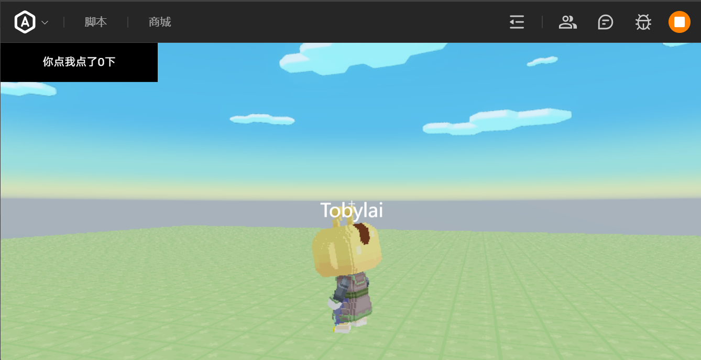

# Areact
:::warning 使用前三思
目前神岛client端编辑器的优化很烂，过大的体积会导致地图无法打开。而目前此库体积`256kb`左右，有几率导致崩溃……
- 呼叫大板砖支援
- 呼叫大板砖支援
- 呼叫大板砖支援
:::
Areact是一个基于Preact的UI框架，能够在[神奇代码岛](https://dao3.fun)上利用类似React的方式创建UI界面。

## 快速开始
:::info[快速上手]
需要新手入门教程？请点击[这里](./getting-started)
:::


## 速览(简单示例)

```tsx title="clientApp.tsx"
import { Areact, hooks } from "dao3-areact";
import { Text } from "dao3-areact/components";
let app = new Areact();
// 这是UI的根组件
function App() {
  const [count,setCount]=hooks.useState(0);
  return (<>
    {/* 文字组件，点击+1 */}
    <Text x="0px" y="0px" height="50px" width="200px"
      backgroundColor="#000000"
      textColor="#ffffff"
      backgroundOpacity="100%"
      text={`你点我点了${count}下`}
      onClick={(e)=>{setCount(count+1)}}
    ></Text>
  </>);
}
// 挂载根组件 开始渲染
app.mount(<App />, ui);
```

## 优势
- 与[ArenaPro](https://www.yuque.com/box3lab/arenapro)或者[ArenaLess](/docs/arenaless/)结合使用，TypeScript助力开发
- React 的写法，有React的优点，例如状态更新等
- 支持`React`的`Hooks`，例如`useState`、`useEffect`等
- 事件写法更为清晰，可以在节点上`onClick`,`onInput`等
- 组件化的编程方式，十分简单地创建起属于你的组件库，避免了复制粘贴。
- 近似于`html`的风格，有特色的组件参数绑定

## 缺点
- 性能开销略高
- 可能会出现bug
- 打包体积较大，输出`256kb`左右，可能会导致地图崩溃
- 有一些神岛自带的组件无法使用，原因是搬砖没有写JavaScriptAPI，只做了编辑器……