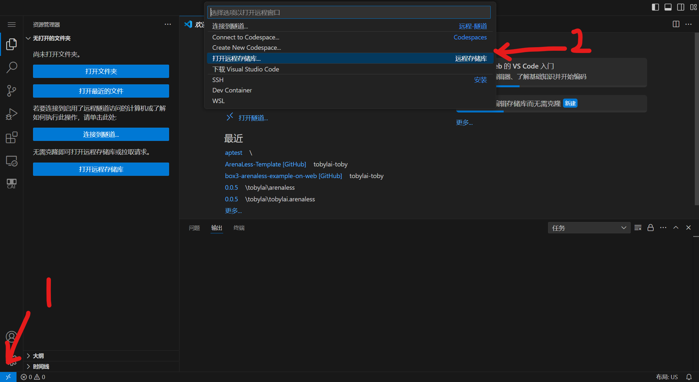

# ArenaLess，在线版VSCode上链接Github储存库开发
ArenaLess是一个兼容在线版VSCode的插件，这意味着你可以在线链接Github编写代码、提交代码，从而更好地维护你的项目。（前提是你熟练使用Github的话）。
## 创建储存库
1. 登录Github
2. 打开 [tobylai-toby/ArenaLess-Template](https://github.com/tobylai-toby/ArenaLess-Template) 这个储存库，右上角有个`use this template`，点击它，选择`create a new repository`，指定一个名字。然后把可见性设置为`Private`。（当然如果你想完全公开你的代码的话……那就Public）
3. 打开 [vscode.dev](https://vscode.dev)，左下角那个`打开远程窗口`的小按钮，选择`打开远程储存库`，登录`Github`，选中你刚创建的项目。

4. 打开项目，你会看见ArenaLess/ArenaPro的目录结构。
> 如果`AL`按钮没有出现，请按<kbd>Ctrl+Shift+P</kbd>然后用命令`ArenaLess: 激活ArenaLess扩展 (WEB版可能不能自动激活)`
5. 好了，现在可以正常使用ArenaLess的所有功能了。登陆账号、链接地图、构建上传代码吧。