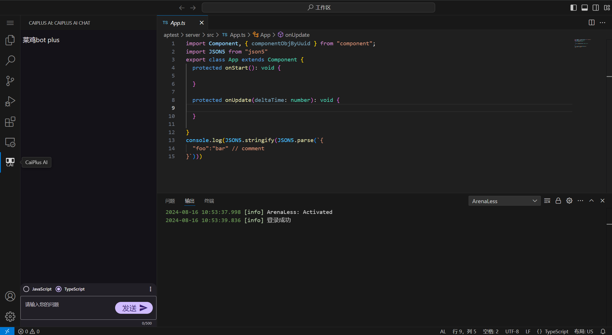
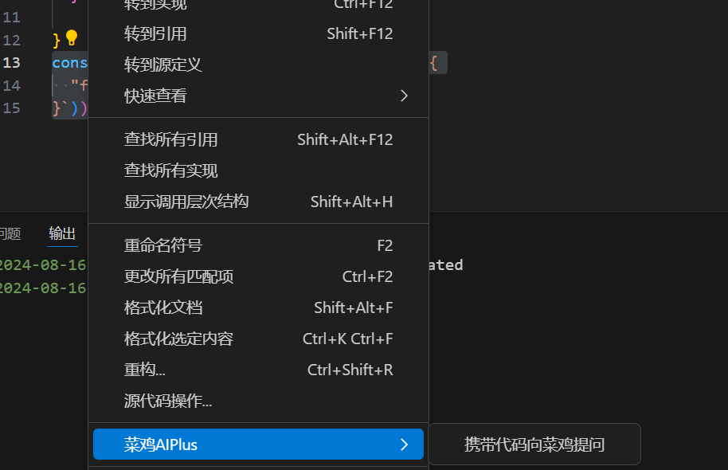

# 菜鸡AIPlus

菜鸡AI界面如上图👆

## 菜鸡AIPlus能干什么？
1. 你可以向他提问代码相关的问题，例如提需求之类的，他会帮你生成代码。（但能力并不太强，这不是他最擅长的）
2. 在编辑器中选中代码右键找到`菜鸡AIPlus> 携带代码向菜鸡提问`，即可把代码添加到聊天界面，此时你可以输入问题点击`发送`。
例如：输入`请帮我重构一下这段代码` `这段代码在干什么，请解释一下`。菜鸡AIPlus更擅长解释。

3. 菜鸡AIPlus的回答带有参考资料，可以点击跳转。

## 引用
1. [新用户手册](https://box3.yuque.com/staff-khn556/wupvz3)
2. [BOX3 API文档](https://www.yuque.com/box3lab/api)
3. [神岛ArenaPro Creator手册](https://www.yuque.com/box3lab/arenapro)
4. ArenaLess