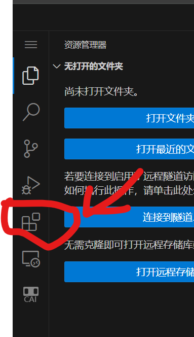

# ArenaLess

## ArenaLess 是什么？
ArenaLess有点类似于ArenaPro的一个替代品？但其目标并非取代ArenaPro，而是为了让用户可以在**VSCode在线版**（是的没错，在线的vscode）上体验到近似于`ArenaPro`的`TypeScript`+`神奇代码岛Arena`的编程体验。

支持VSCode与TypeScript的神岛游戏制作插件
告别繁琐，拥抱高效！神岛ArenaLess插件，专为游戏开发者设计，旨在通过无缝集成VSCode本地版、[VSCode在线版](https://vscode.dev)与神岛Arena编辑器，为游戏开发带来前所未有的便捷与效率。本插件不仅解决了Arena编辑器功能单一、开发体验不佳的问题，还引入了TypeScript支持，为游戏开发提供更丰富的功能和体验。

👆 以上文字修改自ArenaPro的介绍

本插件旨在实现神岛实验室的ArenaPro的核心功能，并且可以在[VSCode在线版 vscode.dev](https://vscode.dev)和本地版上运行。使用vscode.dev链接到Github仓库后，您就可畅享在任何设备的`TypeScript`+`Arena`编程体验。

## 如何安装？
ArenaPro虽然目标是为了在VSCode在线版中安装，但依然支持本地版。
### VSCode.dev （在线版）
[点击这里](https://vscode.dev) 打开VSCode在线版，点击侧边栏的扩展图标，搜索`arenaless`，点击`安装`。

### VSCode（本地版）
步骤相同，打开vscode后在`扩展`搜索`arenaless`安装。

## 快速入门
[点击这里](/docs/arenaless/quickstart.md)

## ArenaLess相比ArenaPro，多了/少了哪些特性？
arenaless之所以叫arenaless，是在于它几乎只保留了ArenaPro的核心功能。这有一份对比：

> 以下将arenaless简称al,arenapro简称ap

| 特性/扩展 | ArenaLess | ArenaPro Creator | 备注 |
| --- | --- | --- | --- |
| 创建项目 | √ | √ | |
| 登录神岛账号 | √ | √ | |
| 构建并上传 | √* | √ | al的构建不会输出到`dist`，为了Web平台精简
| 链接到扩展地图 | √ | √ | | 
| 链接到普通地图 | × | × | |
| AI 助手 | √* | √ | al的`菜鸡AIPlus`功能和智商都逊色于ap的`Chat吉PT`,吉pt的功能十分强大 |
| 内置创作端Webview | ×* | √ | al在web环境中建议使用浏览器直接打开 | |
| 自动更新.d.ts | × | √ | al目前不支持自动更新.d.ts，会固定使用模板内的 | |
| 打包 | `ts`+`rollup`+`esbuild` | `ts`+`webpack`+`terser` | |
| 网络导入 | √ | × | |
| npm | ×* | √ | al使用网络导入代替本地npm，可以`import ... from "npm:模块名"` |

## 鸣谢
- 感谢`@冷鱼闲风`大佬的指点。
- 感谢原ArenaPro项目。
- 感谢神岛实验室。
- 感谢神奇代码岛。
- 感谢岛研所。
### 以下项目对本项目的实现有很大帮助
- @rollup/browser及其virtual,alias插件。这是本插件打包器的实现。
- esbuild-wasm 用于压缩js代码(以后可能会变更)
- pako 用来解压缩gzip (模板是gzip压缩过的)
- [esm.sh](https://esm.sh) AL使用它来获取npm,jsr,gh模块。
- hono API中转服务器