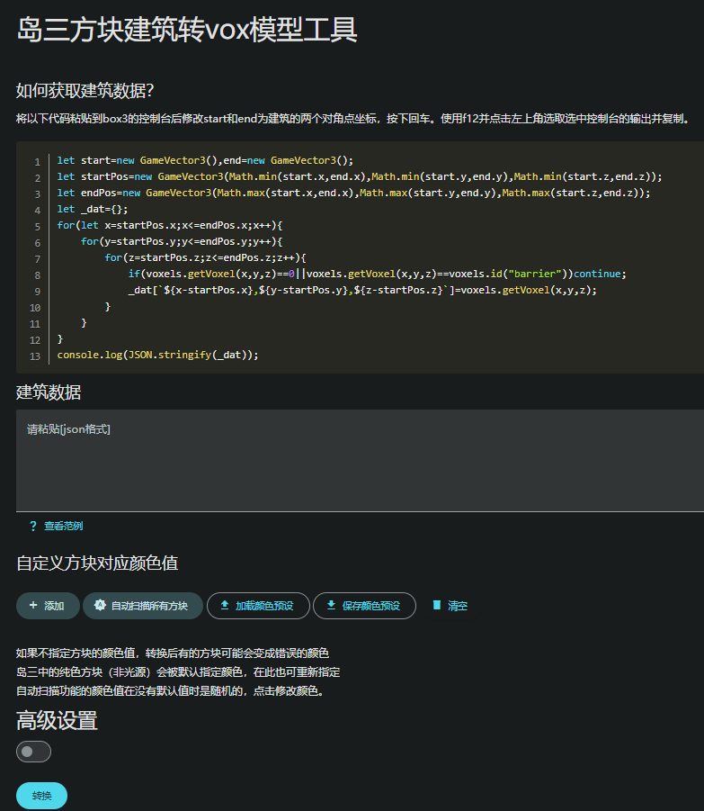

# 建筑转Vox模型

## 使用步骤
1. 复制图示代码，修改start和end为建筑两个对角点坐标，在岛三控制台中运行
2. 运行完成后使用<kbd>F12</kbd>Dev tools复制建筑数据并粘贴到`建筑数据`
3. 点击自动扫描所有方块
    
4. 点击列表中的方块修改颜色（修改完可以保存预设到本地）
5. 点击转换，查看下载列表

## 高级设置
### 轴排列
默认：`xzy`

通过修改此选项可以实现旋转效果，大写某个轴即为反转轴，调转轴的顺序即可实现旋转效果。