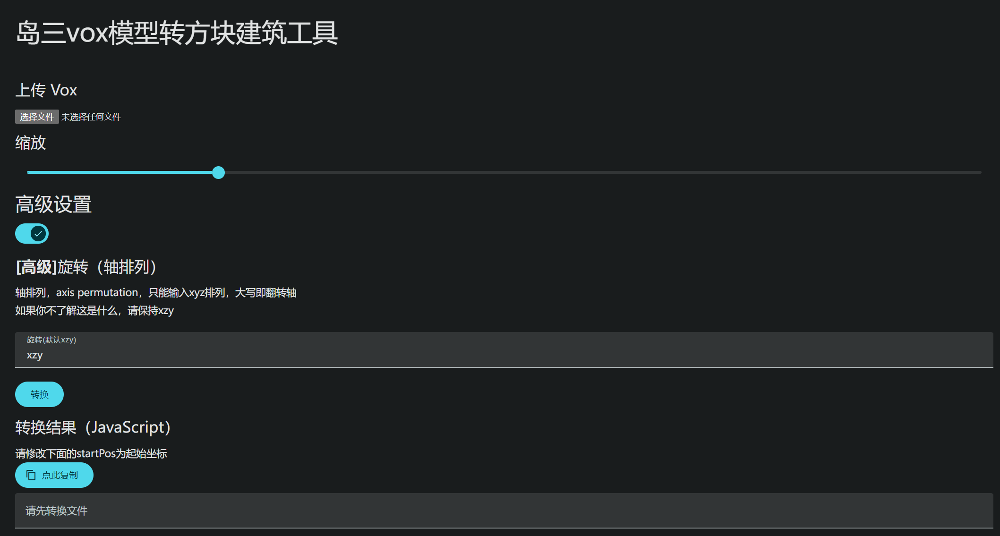

# Vox模型转建筑

## 使用步骤
1. 上传 vox 模型文件
2. 修改缩放值滑块0~1
3. 点击`转换`
4. 修改转换结果中的`new GameVector3()`为起始坐标
5. 点击`点此复制`，复制到剪贴板
6. 打开岛三地图控制台，运行地图，粘贴代码测试。如果测试正常，就可以停止运行，然后再次粘贴该代码。

## 高级设置
### 轴排列
默认：`xzy`

通过修改此选项可以实现旋转效果，大写某个轴即为反转轴，调转轴的顺序即可实现旋转效果。