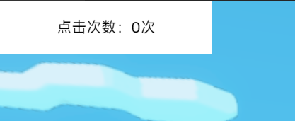
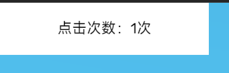

import Tabs from '@theme/Tabs';
import TabItem from '@theme/TabItem';

:::danger 迁移！
dao3-aui不再维护，请迁移到Areact
:::

# 快速上手
:::warning
本文默认你已经掌握 **ArenaPro(或者ArenaLess)** 插件的基本用法，如未了解，请先阅读[ArenaPro](https://www.yuque.com/box3lab/arenapro)插件文档。
:::
## 设置开发环境
:::info
为了使用React+JSX/TSX，你在每个需要dao3-aui的项目都需要先完成以下步骤
:::
1. 请确保你已经配置好 VSCode 插件`ArenaPro`并安装好`Node.js`
2. 创建一个ArenaPro项目
3. 修改文件名、文件入口点
    - 将 `client/src/clientApp.ts` 重命名为-> `client/src/clientApp.tsx`
    - 将 `dao3.config.json` 中的 `client->entry` 改为 `src/clientApp.tsx`（类似下面这样）
    ```js title="dao3.config.json"
    {
        "client": {
            "base": "./client",
            "entry": "src/clientApp.tsx",
            ...省略...
        }
    }
    ```
4. 修改`client/tsconfig.json`
    - 需要在`compilerOptions`中加入一些jsx/tsx相关的配置
    ```js title="client/tsconfig.json"
    {
        "compilerOptions": {
            // ...省略...
            "noImplicitAny": false,// 这四行是要添加的内容
            "jsx": "react",
            "jsxFactory": "AUIApp.h",
            "jsxFragmentFactory": "AUIApp.frag"
            // ...省略...
        }
    }
    ```

## 安装 dao3-aui 库
:::info
以下是ArenaPro和ArenaLess安装dao3-aui库的方式
:::
<Tabs>
  <TabItem value="ap" label="ArenaPro Creator" default>
    打开终端，切换到项目根目录，执行如下命令
    ```sh
    npm install --save dao3-aui
    ```
  </TabItem>
  <TabItem value="al" label="ArenaLess">
    修改 `importMap.arenaless.jsonc`，在 `"imports"` 下添加 `"dao3-aui":"npm:dao3-aui"`，类似下图。
    ```js title="importMap.arenaless.jsonc"
    {
        "imports": {
            "dao3-aui":"npm:dao3-aui"
        }
    }
    ```
  </TabItem>
</Tabs>

## 你的第一段代码
:::info
理解以下内容需要有React基础知识，如果没有的话，请先阅读React的[这篇文档](https://zh-hans.react.dev/learn)。阅读完后你会掌握基本概念。(当然，我们这里没有这么多的html标签……)
:::

那我们先来一个`Counter`示例吧！点击一个按钮，显示的数字会随之增加。
### Counter 计数器
```tsx title="client/src/clientApp.tsx"
import { AUIApp, hooks } from "dao3-aui";
// 创建一个AUIApp实例
let aui = new AUIApp();

// 这个就是入口点的组件，渲染从这里开始
function App() {
  const [count,setCount]=hooks.useState<number>(0);
  return (<>
    <ui-text x="0" y="0" height="50px" width="200px" 
      background-color="#ffffff" background-opacity="100%" 
      onClick={()=>setCount(count+1)}
      text-content={"点击次数："+count.toString()+"次"}></ui-text>
  </>)
}
// 挂载到屏幕上
aui.mount(<App />, ui);
```
使用ArenaPro或ArenaLess `构建->上传` 到链接地图

#### 效果
- 点击按钮，数字会增加

  
- 点击后

  

## 更多教程
[点击阅读教程](./guide)